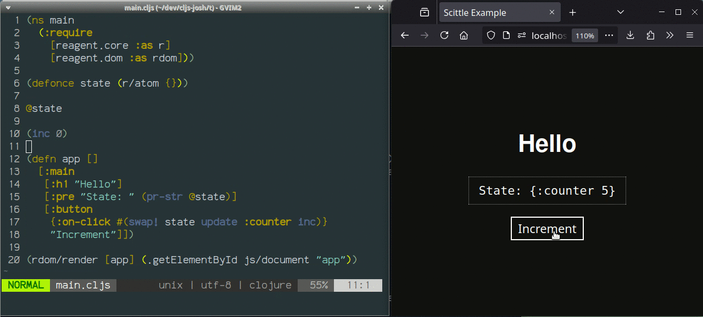

Vim plugin to display CIDER-style inline evaluation results from [vim-fireplace](https://github.com/tpope/vim-fireplace).



This plugin hooks into vim-fireplace via `FireplaceEvalPost` and displays the evaluation results inline, in addition to printing results at the bottom of the screen.

```
(inc 0) => 1
```

Install it the normal way you install Vim plugins e.g. check out into `~/.vim/bundle` etc.
